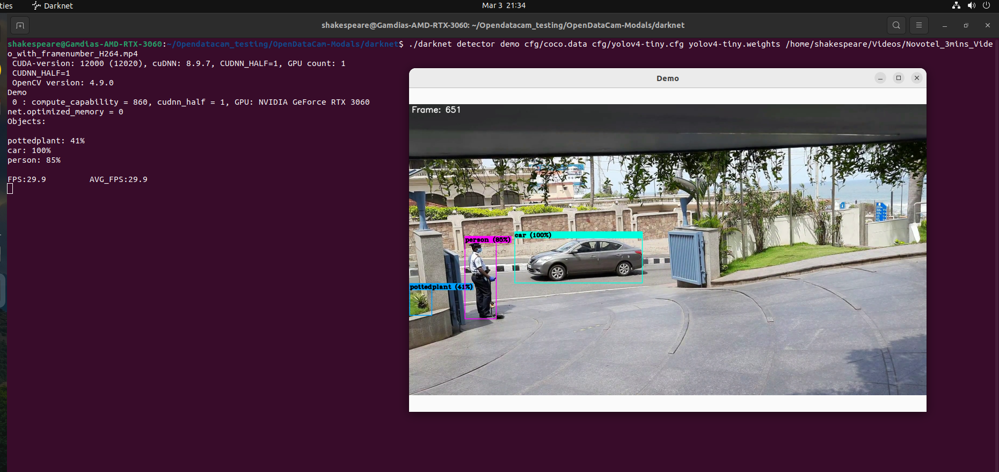
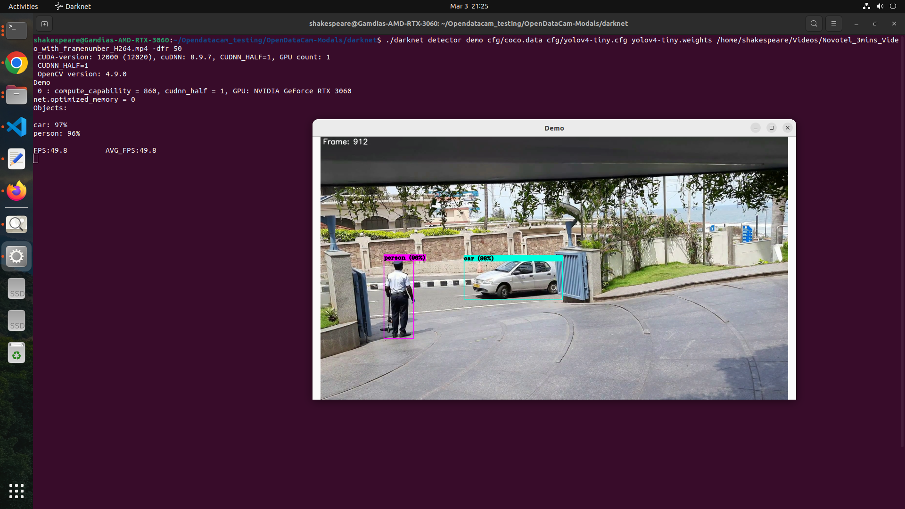
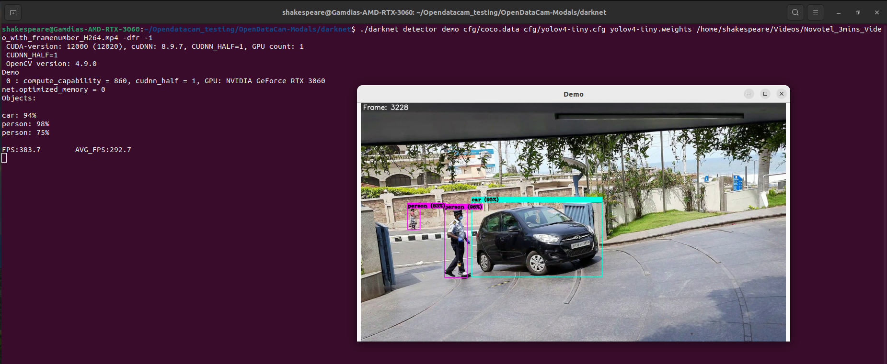
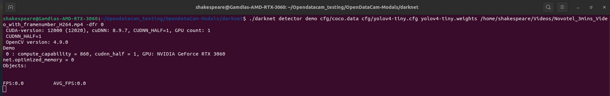
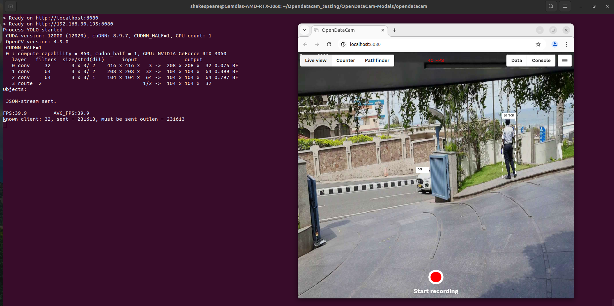
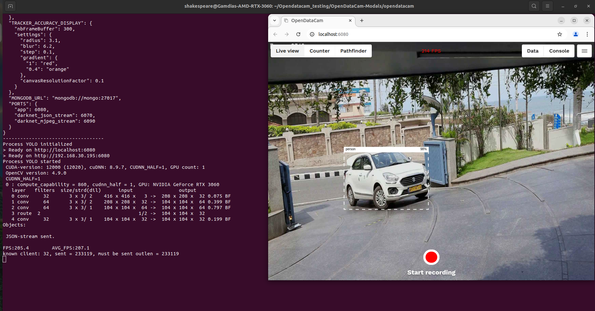

# OpenDataCam-Modals – Enhanced Object Detection with Darknet Integration

OpenDataCam-Modals integrates OpenDataCam with Darknet to improve real-time object detection and visualization. By leveraging pre-trained YOLO models (YOLOv4 and YOLOv4-tiny), it enhances OpenDataCam's capabilities, making it more suitable for various use cases such as traffic analysis, crowd monitoring, and beyond.

With OpenDataCam-Modals, users can track moving objects from live camera feeds or video files, benefiting from Darknet’s cutting-edge accuracy in detecting over 50 common objects.

Popular use cases include traffic studies (e.g., modal split analysis, turn-count analysis), though OpenDataCam-Modals is flexible enough to detect a wide range of objects. Additionally, custom models can be trained for specific tasks if required.

By combining OpenDataCam and Darknet, the system uses machine learning to detect and track objects in video streams. Users can set up counters through the UI or API, and every time an object crosses a counter, it gets logged for further analysis.

Darknet integration boosts both detection accuracy and processing speed, making OpenDataCam-Modals ideal for applications requiring real-time, high-speed object detection.


## Demo Videos

| 👉 [UI Walkthrough (2 min, OpenDataCam 3.0)](https://vimeo.com/432747455) | 👉 [UI Walkthrough (4 min, OpenDataCam 2.0)](https://vimeo.com/346340651) | 👉 [IoT Happy Hour #13:  OpenDataCam 3.0](https://youtu.be/YfRvUeSLi0M?t=1000 ) |
| ------------------------------------------------------------ | ------------------------------------------------------------ | ------------------------------------------------------------ |
| [](https://vimeo.com/432747455) | [](https://vimeo.com/346340651) | [](https://youtu.be/YfRvUeSLi0M?t=1000) |


## Features

This repo contains all the features offered by OpenDataCam [features](https://opendata.cam/features) along with 

- FPS Control from the [configuration](./config.json)

## 🎬 Get Started, quick setup

The quickest way to get started with OpenDataCam is to use the existing Docker Images.

### Pre-Requesits

- You will need Docker and Docker-Compose installed. 
- If you want to run OpenDataCam on a NVIDIA GPU you will additonally need
- [Nvidia CUDA 11 and cuDNN 8](https://developer.nvidia.com/cuda-downloads)
- [Nvidia Container toolkit installed](https://github.com/NVIDIA/nvidia-docker)
- You also need to install `nvidia-container-runtime`
- To run OpenDataCam on a NVIDIA Jetson device you will need [Jetpack 5.x](https://developer.nvidia.com/embedded/jetpack-sdk-512).
- [Node.js 12.22.9](https://nodejs.org/en/download/package-manager)
- [npm 8.5.1](https://www.npmjs.com/package/download)
- [MongoDB 7.0.14](https://www.mongodb.com/try/download/community)

### Installation

- **Node.js and npm Installation**
```bash
# download Node.js
curl -fsSL https://deb.nodesource.com/setup_12.x | sudo -E bash -

# install Node.js
sudo apt install nodejs

# verify Node.js installation
nodejs --version

# install npm
sudo apt install npm

# verify npm installation
npm -v
```

- **MongoDB Installation**
```bash
# Download the MongoDB from the website
wget -qO - https://pgp.mongodb.com/server-7.0.asc | sudo tee /etc/apt/trusted.gpg.d/mongodb.asc

# Add MongoDB package into sources list
echo "deb [ arch=amd64,arm64 ] https://repo.mongodb.org/apt/ubuntu jammy/mongodb-org/7.0 multiverse" | sudo tee /etc/apt/sources.list.d/mongodb-org-7.0.list

# update the source list and install the MongoDB package
sudo apt update
sudo apt install -y mongodb-org=7.0.14 mongodb-org-server=7.0.14 mongodb-org-shell=7.0.14 mongodb-org-mongos=7.0.14 mongodb-org-tools=7.0.14

# verify the installation
mongod -v
mongod --version

# start systemctl MongoDB service and enable the service
sudo systemctl start mongod
sudo systemctl enable mongod
```
 Note: Before you have install these create a Directory first after you have to install
```bash
mkdir <Directory name>
cd <Directory name>
git clone https://github.com/xactai/OpenDataCam-Modals.git
cd opendatacam
npm install
npm run build
npm run start
```

- **Build and Compile Darknet**
```bash
cd darknet 
make clean
make -j8
```
install yolov4-yiny weights you have download for darknet runs.
```bash
wget https://github.com/AlexeyAB/darknet/releases/download/yolov4/yolov4-tiny.weights
```

### Running the Application (Local)
- Modify the [config](config.json) file and provide the details such as,
  - darknet path
  - neural network name
  - video input option
  - desired classes which needs to be identified
  - desired colour code for each class
  - neural network configuration files
  - mongodb ports
  - http ports

- For further information on changing the configuration options refer [configuration](https://opendata.cam/docs/configuration/)


### Running the Application (Docker)

- Follow the "execution_commands_opendatacam.txt" file for running the application in Docker

[click here for execution commands](documentation/execution_commands_opendatacam)

[click here for Docker file](documentation/opendatacam_Dockerfile.tar)

## Configuring DFR (Darknet Frame Rate) in Darknet

- This guide explains how to manage the Darknet Frame Rate (DFR) when processing video input using YOLOv4 and YOLOv4-tiny models.

Run commands for Darknet:

- **Default DFR (30 FPS without specifying DFR argument)**

Darknet runs at 30 FPS if no DFR argument is provided.
```bash
./darknet detector demo cfg/coco.data cfg/yolov4.cfg yolov4.weights <video_path>
```
Output:




- **Custom DFR (with specified frame rate)**

- Specify any frame rate using the -dfr argument (e.g., -dfr 50).
```bash
./darknet detector demo cfg/coco.data cfg/yolov4-tiny.cfg yolov4-tiny.weights <video_path> -dfr XX
```
Output:



- **Maximum Speed Mode (DFR=-1)**

When you set DFR=-1, Darknet will run as fast as possible, utilizing the full capacity of your system. This mode allows the detection to proceed at maximum speed without any frame rate limitations.

```bash
./darknet detector demo cfg/coco.data cfg/yolov4-tiny.cfg yolov4-tiny.weights <video_path> -dfr -1
```
Output:




- **Dummy Mode (DFR=0)**

Darknet runs without detection in a no-video playback simulation mode.
```bash
./darknet detector demo cfg/coco.data cfg/yolov4-tiny.cfg yolov4-tiny.weights <video_path> -dfr 0
```
Output:




#### <font color=green><b> YOLOv4 can handle up to 45 DFR, but for 60 DFR, you may need to modify the yolov4.cfg file (e.g., reducing height and width to 416)</font></b>

- ### OpenDataCam Modifications

- The OpenDataCam code has been enhanced to support configuring the Darknet Frame Rate (DFR) through a Darknet command-line argument. This update allows users to easily set or modify the DFR directly from the configuration file, providing a more streamlined and user-friendly experience..

Additionally, the configuration file has been updated with an option for DFR:

    DFR =XX

- DFR Option (with Specified Frame Rate)

Below are the output images demonstrating OpenDataCam's performance with different DFR settings:

DFR=-1: Running at maximum speed, utilizing the system’s full capacity 


DFR=XX: Running with a user-specified custom frame rate.




## 🔌 API Documentation

In order to solve use cases that aren't taken care by our opendatacam base app, you might be able to build on top of our API instead of forking the project.

[https://opendatacam.github.io/opendatacam/apidoc/](https://opendatacam.github.io/opendatacam/apidoc/)

## 🗃 Data export documentation

- [Counter data](https://opendatacam.github.io/opendatacam/apidoc/#api-Recording-Counter_data)
- [Tracker data](https://opendatacam.github.io/opendatacam/apidoc/#api-Recording-Tracker_data)

## 🎯 How accurate is OpenDataCam ?

Accuracy depends on which YOLO weights your hardware is capable of running.

We are working on [adding a benchmark](https://github.com/opendatacam/opendatacam/issues/87) to rank OpenDataCam on the [MOT Challenge (Multiple Object Tracking Benchmark)](https://motchallenge.net/)

## 🚤 How fast is OpenDataCam ?

FPS depends on:

- which hardware your are running OpenDataCam on
- which YOLO weights you are using

We made the default settings to run at least at 10 FPS on any Jetson.

Learn more in the [Customize OpenDataCam documentation](documentation/CONFIG.md#Change-neural-network-weights)

## 🛠 Development notes

See [Development notes](documentation/DEVELOPMENT_NOTES.md)

Technical architecture overview:


## 💌 Acknowledgments

- Original darknet @pjreddie  : [https://pjreddie.com/darknet/](https://pjreddie.com/darknet/)
- Darknet fork + YOLOv4 by @alexeyab : [https://github.com/alexeyab/darknet](https://github.com/alexeyab/darknet)
- IOU / V-IOU Tracker by @bochinski : [https://github.com/bochinski/iou-tracker/](https://github.com/bochinski/iou-tracker/)
- Next.js by @zeit : [https://github.com/zeit/next.js](https://github.com/zeit/next.js)


